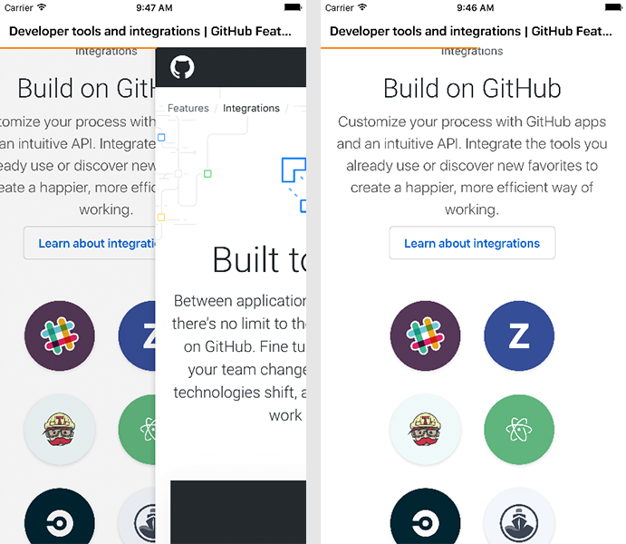

# MMWebView

[](https://raw.githubusercontent.com/CheeryLau/MMWebView/master/LICENSE)&nbsp;
[](http://cocoapods.org/?q=MMWebView)&nbsp;
[](http://cocoapods.org/?q=MMWebView)&nbsp;

     


类似微信的`webView`进度条加载，支持右滑(侧滑)返回，`MMWebView`继承于`WKWebView`，按照`UIWebView`代理的方式，重写WKNavigationDelegate。写本控件的初衷是因为公司项目中多使用`UIWebView`，为了添加右滑(侧滑)返回和进度条，如果改成`WKWebView`，工作量比较大。所以写了`MMWebView`，方便全局修改。至于进度条，可以用使用本控件中的，也可以自己写。希望本控件可以帮助到你。

更多`WKWebView`的相关知识，可以查阅SDK，[这篇文章](https://github.com/CheeryLau/WKWebView)或许也会有些帮助。

## 使用 

1. `pod "MMWebView"`;
2. `pod install` / `pod update`;
3. `#import <MMWebView.h>`.

## 示例

```objc
// 初始化
_webView = [[MMWebView alloc] initWithFrame:self.view.bounds];
// 代理
_webView.delegate = self;
// 显示进度条
_webView.displayProgressBar = YES;
// 允许侧滑返回
_webView.allowsBackForwardNavigationGestures = YES;
// 加载
[_webView loadRequest:[NSURLRequest requestWithURL:[NSURL URLWithString:@"https://www.baidu.com"]]];
// 添加视图
[self.view addSubview:_webView];
```

## 属性

```objc
// 代理
@property (nonatomic, assign) id<MMWebViewDelegate> delegate;
// 是否显示进度条[默认 NO]
@property (nonatomic, assign) BOOL displayProgressBar;
// displayProgressBar为YES是可用
@property (nonatomic, strong) UIColor *progressTintColor;
// displayProgressBar为YES是可用
@property (nonatomic, strong) UIColor *trackTintColor;

```

## 代理

```objc
@protocol MMWebViewDelegate <NSObject>
@optional
// 网页加载进度
- (void)webView:(MMWebView *)webView estimatedProgress:(CGFloat)progress;
// 网页标题更新
- (void)webView:(MMWebView *)webView didUpdateTitle:(NSString *)title;
// 网页开始加载
- (BOOL)webView:(MMWebView *)webView shouldStartLoadWithRequest:(NSURLRequest *)request navigationType:(WKNavigationType)navigationType;
// 网页开始加载
- (void)webViewDidStartLoad:(MMWebView *)webView;
// 网页完成加载
- (void)webViewDidFinishLoad:(MMWebView *)webView;
// 网页加载出错
- (void)webView:(MMWebView *)webView didFailLoadWithError:(NSError *)error;

@end
```

## 清缓存

本控件是清除所有缓存，也可以清理指定缓存，所有缓存类型如下：

```objc
 NSString * const WKWebsiteDataTypeDiskCache；
 NSString * const WKWebsiteDataTypeMemoryCache；
 NSString * const WKWebsiteDataTypeOfflineWebApplicationCache；
 NSString * const WKWebsiteDataTypeCookies；
 NSString * const WKWebsiteDataTypeSessionStorage；
 NSString * const WKWebsiteDataTypeLocalStorage；
 NSString * const WKWebsiteDataTypeWebSQLDatabases；
 NSString * const WKWebsiteDataTypeIndexedDBDatabases；
```

清理缓存

```objc
// 清缓存
[_webView clearCache];
```
 
 具体实现如下：
 
```objc
- (void)clearCache
{
    // 所有类型缓存[详见WKWebsiteDataRecord]
    NSSet *websiteDataTypes = [WKWebsiteDataStore allWebsiteDataTypes];
    // 所有时间
    NSDate *date = [NSDate dateWithTimeIntervalSince1970:0];
    // 移除
    [[WKWebsiteDataStore defaultDataStore] removeDataOfTypes:websiteDataTypes
                                               modifiedSince:date
                                           completionHandler:^{
                                               
                                           }];
}
```

## 后记

如有问题，欢迎给我[留言](https://github.com/CheeryLau/MMWebView/issues)，如果这个工具对你有些帮助，请给我一个star，谢谢。😘😘😘😘

💡 💡 💡 
欢迎访问我的[主页](https://github.com/CheeryLau)，希望以下工具也会对你有帮助。

1、自定义视频采集/图像选择及编辑/音频录制及播放等：[MediaUnitedKit](https://github.com/CheeryLau/MediaUnitedKit)

2、类似滴滴出行侧滑抽屉效果：[MMSideslipDrawer](https://github.com/CheeryLau/MMSideslipDrawer)

3、图片选择器基于AssetsLibrary框架：[MMImagePicker](https://github.com/CheeryLau/MMImagePicker)

4、图片选择器基于Photos框架：[MMPhotoPicker](https://github.com/CheeryLau/MMPhotoPicker)

5、webView支持顶部进度条和侧滑返回:[MMWebView](https://github.com/CheeryLau/MMWebView)

6、多功能滑动菜单控件：[MenuComponent](https://github.com/CheeryLau/MenuComponent)

7、仿微信朋友圈：[MomentKit](https://github.com/CheeryLau/MomentKit)

8、图片验证码：[MMCaptchaView](https://github.com/CheeryLau/MMCaptchaView)

9、源生二维码扫描与制作：[MMScanner](https://github.com/CheeryLau/MMScanner)

10、简化UIButton文字和图片对齐：[UUButton](https://github.com/CheeryLau/UUButton)

11、基础组合动画：[CAAnimationUtil](https://github.com/CheeryLau/CAAnimationUtil)

