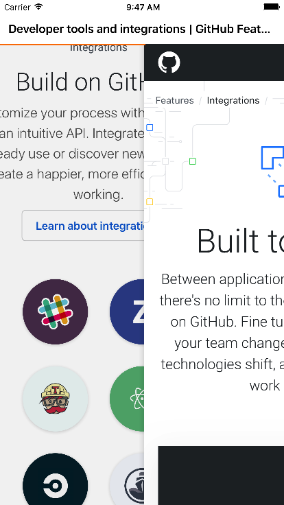

# MMWebView

[](https://raw.githubusercontent.com/dexianyinjiu/MMWebView/master/LICENSE)&nbsp;
[](http://cocoapods.org/?q=MMWebView)&nbsp;
[](http://cocoapods.org/?q=MMWebView)&nbsp;

      

类似微信的webView进度条加载，支持右滑/侧滑返回，MMWebView继承于WKWebView，按照UIWebView代理的方式，重写WKNavigationDelegate。写本控件的初衷是因为公司项目中多使用UIWebView，为了添加右滑返回和进度条，如果改成WKWebView，工作量比较大。所以写了MMWebView，方便全局修改。至于进度条，可以用使用本控件中的，也可以自己写。希望本控件可以帮助到大家。

## 安装[CocoaPods]

1. `pod 'MMWebView', '~> 1.0'`;
2. `pod install` / `pod update`;
3. `#import <MMWebView.h>`.

## 示例

```objc
_webView = [[MMWebView alloc] initWithFrame:self.view.bounds];
_webView.backgroundColor = [UIColor whiteColor];
_webView.opaque = NO;
_webView.delegate = self;
_webView.displayProgressBar = YES;
_webView.allowsBackForwardNavigationGestures = YES;
[_webView loadRequest:[NSURLRequest requestWithURL:[NSURL URLWithString:@"http://news.baidu.com"]]];
[self.view addSubview:_webView];
```

```objc
//## 属性

//代理
@property (nonatomic,assign) id<MMWebViewDelegate> delegate;
//是否显示进度条
@property (nonatomic,assign) BOOL displayProgressBar;
//displayProgressBar为True是可用
@property(nonatomic, strong) UIColor *progressTintColor;
//displayProgressBar为True是可用
@property(nonatomic, strong) UIColor *trackTintColor;


//## 代理
@protocol MMWebViewDelegate <NSObject>

@optional
// 网页加载进度
- (void)webView:(MMWebView *)webView estimatedProgress:(CGFloat)progress;
// 网页标题更新
- (void)webView:(MMWebView *)webView didUpdateTitle:(NSString *)title;

// 网页开始加载
- (BOOL)webView:(MMWebView *)webView shouldStartLoadWithRequest:(NSURLRequest *)request navigationType:(WKNavigationType)navigationType;
// 网页开始加载
- (void)webViewDidStartLoad:(MMWebView *)webView;
// 网页完成加载
- (void)webViewDidFinishLoad:(MMWebView *)webView;
// 网页加载出错
- (void)webView:(MMWebView *)webView didFailLoadWithError:(NSError *)error;

@end
```

## 使用要求

* iOS 8.0 or later.
* Xcode 8.0 or later.
* OS X 10.10 or later.

## 许可证

MIT


